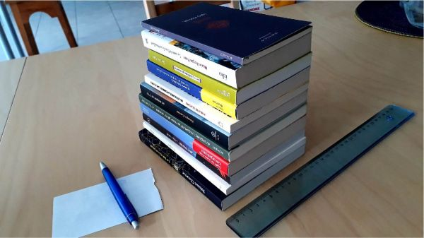

Éloignement du collectif et covid obligent, ça faisait un certain temps que les membres des éditions du samedi et ses auteurs ne s'étaient pas vus en vrai ; et dans les têtes commençait à trotter l'idée de remplacer une de nos visio-réunions mensuelles par une journée d'échanges autour de nos projets (et des projets, c'est pas ça qui manque).

Nous nous enfermâmes donc au siège parisien de l'association en ce beau samedi ensoleillé-frisquet du 9 avril, veille d'élection présidentielle (la nôtre ayant eu lieu quelques semaines auparavant lors de notre Assemblée générale*) pour réfléchir au FUTUR : nous avons fait le point sur l'avancement de chacun des manuscrits et décidé d'en publier deux cette année, en plus de continuer à peaufiner les autres.

Oui, vous avez bien lu. Cinq ans après la publication de leur premier ouvrage vagabond, [Durant les travaux, l'exposition continue](https://editionsdusamedi.fr/fr/static6/9782956245506), fortes de leur retentissant succès, les éditions du samedi s'apprêtent à lancer non pas le, mais les deux premiers romans de leur collection de fictions à la forme plus classique, Traversées. Avant la fin de l'année, puisqu'elles cultivent le goût du défi.

Comme on ne pouvait décemment pas se contenter de prendre cette décision au vu de l'échéance que l'on s'est fixée, on en a profité pour imaginer comment on voyait ces livres, principalement en empilant une belle collection de poches trônant au siège afin de se faire une idée des divers formats et choisir le nôtre, suffisamment précisément d'ailleurs pour qu'on puisse commencer à lancer des demandes de devis, qui d'illustration, qui de correction, qui d'impression (merci Anne-Laure !).

Après de longs échanges, des questions existentielles ("qui s'y connait en TVA ?", "est-ce qu'une couverture abstraite ça fait pas trop intello ?", "mais où placer les titres ?", "pesto rouge ou vert ?"), des décisions et des todo à rallonge, nous sommes reparti-es, chacun-e dans nos contrées, plein-es d'une nouvelle motivation : c'est que la fin d'année, c'est bientôt, et qu'il ne faudrait pas finasser.

À bientôt donc, avec, au prochain numéro, ~~peut-être~~ certainement, plus d'informations sur ces deux premières Traversées !

* Assemblée générale pour laquelle nous n'avons pas publié de billet spécifique, mais pour laquelle vous trouverez néanmoins rapport d'activité, rapport financier et procès verbal [ici](https://editionsdusamedi.fr/fr/static2/l-asso).