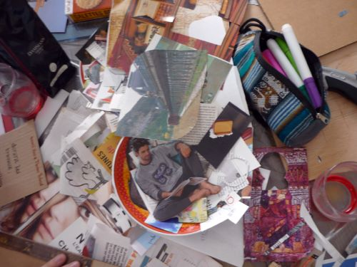

Cabane éditoriale en perpétuel chantier, les éditions du samedi se sont réunies en association pour partager leur kiff :
- rassembler celles et ceux qui veulent tenter une expérience différente de la publication ;
- bouquiner les textes des copaines amenés par courrier brouette ;
- organiser des ateliers pour mettre les livres en forme.

Nos vagabonds de carton et autres traversées littéraires ne voient pas d'inconvénient à vivre à l'air libre, dans les rues, gares et autres bancs publics, à portée de découverte et de hasards.

Aux autrices et auteurs séduits par la perspective de ne pas gagner un rond en faisant circuler leur œuvre à ciel ouvert
Aux amateurs et amatrices de pépites inclassables qui ont envie de les faire bourlinguer
Aux gens qui voyagent dans leur quartier dans leur tête ou sur leur planète
Soyez les bienvenu·es !

Outre consulter notre <a href="/catalogue/" title="Catalogue">catalogue</a>, vous pouvez trouver sur notre site une présentation de <a href="/asso/" title="Association">l'association</a>. Pour ne manquer aucune info, vous pouvez suivre notre actu sur <a href="https://www.facebook.com/editionsdusamedi" target="_blank" title="Facebook">Facebook</a>, <a href="https://www.instagram.com/leseditionsdusamedi" target="_blank" title="Instagram">Instagram</a>, <a href="https://re.lire.im/@editionsdusamedi" target="_blank" title="Mastodon">Mastodon</a> ou notre <a href="/blog/" title="Blog">blog</a>.

À très vite !